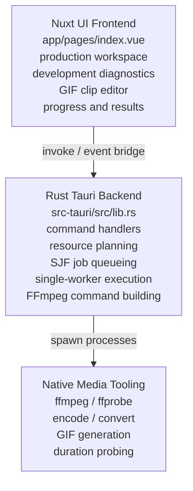

# Architecture Documentation

## Overview

`xcompressor` is a desktop multimedia processing application built with:

- `Tauri 2` for the desktop shell
- `Nuxt 4 + Nuxt UI` for the frontend
- `Rust` for backend orchestration
- `FFmpeg / FFprobe` for media processing and metadata probing

The system is split into three main layers:

1. Presentation layer
2. Application orchestration layer
3. Media execution layer

## High-Level Architecture

## Frontend Architecture

The frontend is currently centered in [app/pages/index.vue](../app/pages/index.vue).

### Responsibilities

- render the desktop workspace
- maintain local UI state for:
  - selected files
  - output directory
  - active mode
  - GIF clip ranges
  - mixed activity queue
  - progress and results
- call backend commands with `invoke`
- subscribe to `batch-progress` events
- enforce UX-level rules such as:
  - GIF mode requiring queued clips
  - active-run progress staying tied to the submitted batch snapshot
  - development-only diagnostics staying out of the production workspace

### Main frontend state groups

- source selection state
- operation configuration state
- GIF editor state
- saved mixed-activity state
- batch progress state
- resource planning state

### Frontend interaction model

The page has two workspace modes:

- production work view:
  - intro and media-type selection
  - configuration and GIF editor
  - compact CPU/RAM/ETA summary
  - selected media or GIF clip queue
- development view:
  - update status
  - detailed resource planner
  - saved activity queue
  - batch monitor
  - raw batch output

The development view is only rendered in development builds.

## Backend Architecture

The Rust backend is implemented in [src-tauri/src/lib.rs](../src-tauri/src/lib.rs).

### Tauri commands

The application exposes these command entry points:

- `get_app_bootstrap`
- `plan_compression`
- `analyze_resource_plan`
- `check_for_app_update`
- `install_app_update`
- `cancel_batch_run`
- `open_media_in_system_player`
- `run_batch_jobs`

### Backend responsibilities

- expose frontend bootstrap metadata
- check and install signed application updates from GitHub Releases
- analyze planned workload against available system resources
- build FFmpeg argument lists by media kind and operation
- resolve bundled FFmpeg / FFprobe binaries inside packaged builds
- schedule submitted jobs with shortest-job-first ordering
- process one FFmpeg job at a time
- cancel tracked FFmpeg processes when the user cancels or closes the app
- emit batch progress events back to the frontend
- return structured per-job results

## Job Model

There are three job modes:

- `compress`
- `convert`
- `gif`

There are two queueing patterns:

1. Simple batch
   - one mode applied to many inputs
2. Mixed activity batch
   - each queued item carries its own mode and settings

### Core request types

- `BatchProcessRequest`
- `MixedJobRequest`
- `GifSegmentRequest`
- `ResourcePlanRequest`

### Core response/event types

- `BatchProcessResponse`
- `BatchJobResult`
- `BatchProgressEvent`
- `ResourcePlan`

## Media Execution Layer

The backend does not implement codecs itself. It delegates media work to FFmpeg.

### Why FFmpeg is the execution boundary

- codec support is already mature
- conversion and compression are cross-platform
- GIF generation is reliable through filter graphs
- probing duration with `ffprobe` is simpler than custom parsing

### FFmpeg-related backend responsibilities

- choose output format per media kind
- choose codec parameters from preset profile
- apply resize filters when configured
- generate GIF palette/filter arguments
- estimate progress from `out_time_us` and probed duration

## Parallelism Model

Execution is intentionally sequential. Earlier parallel execution was removed because multiple FFmpeg jobs can make the desktop less responsive and increase memory pressure.

The backend still builds an internal queue, but it uses one worker:

- queued jobs are estimated before execution
- jobs are sorted shortest-estimated-first
- one worker pops from the queue
- the active run is independent from later UI queue edits
- jobs added during a run wait for the next submitted batch

Shortest-job-first is used to reduce average waiting time and turnaround time for known batches. The app does not use round-robin scheduling because FFmpeg jobs are not cheap to pause and resume.

## Resource Planning Model

Resource planning is advisory plus protective.

The planner:

- reads logical CPU core count
- reads memory availability from `/proc/meminfo` on supported environments
- estimates RAM and duration per job using media kind, operation type, and file size
- derives ETA and memory pressure for the submitted queue
- returns jobs in shortest-estimated-first order

The frontend uses this to:

- surface CPU, RAM, and ETA in the production work view
- show detailed diagnostics in the development view
- keep active-run progress based on the run snapshot

## Cancellation and Shutdown

Each spawned FFmpeg process is registered against its active batch run.

On cancel or app close:

- the run is marked cancelled
- tracked process IDs are terminated
- progress events report cancellation where possible
- shutdown does not wait for long-running FFmpeg jobs to finish naturally

## Platform and Build Architecture

### Local development

- frontend dev server: Nuxt
- desktop runtime: Tauri
- backend build: Cargo

### CI

The GitHub workflow in [.github/workflows/build-desktop.yml](../.github/workflows/build-desktop.yml) builds:

- Windows artifacts
- macOS artifacts

Tagged releases are published through [.github/workflows/publish-release.yml](../.github/workflows/publish-release.yml), which uploads signed updater artifacts to GitHub Releases.

## Current Architectural Constraints

- most frontend logic is still in a single page component
- preview playback depends on webview codec support
- resource planning uses heuristics, not real-time process telemetry
- SJF order depends on estimates, not exact future runtime
- updater availability depends on release signing keys and GitHub Releases metadata being configured in CI

## Recommended Next Refactors

- split the frontend into feature components:
  - workspace shell
  - GIF editor
  - mixed activity queue
  - results monitor
- extract Rust job planning/execution into internal modules
- add retry primitives and persistent job history
- add persistent presets and saved jobs
