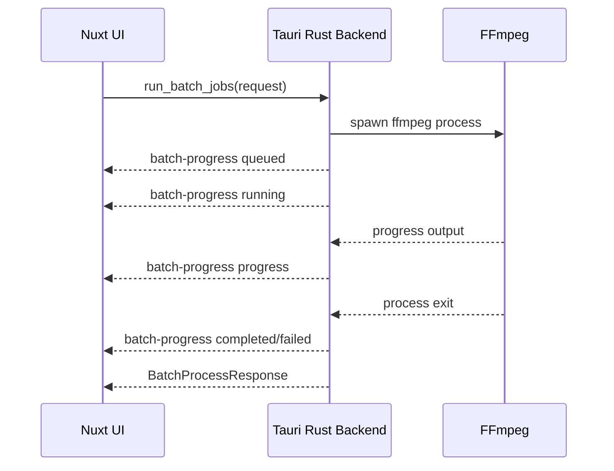
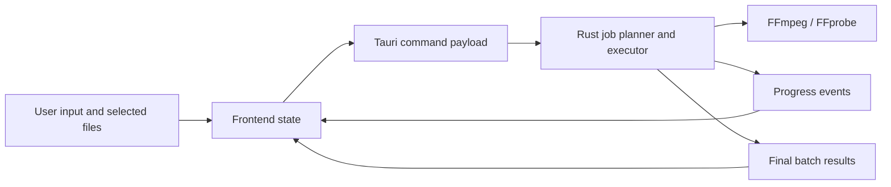

# System Documentation

## Purpose

`xcompressor` is a desktop tool for batch multimedia processing. It supports:

- video compression
- image compression
- audio compression
- format conversion
- GIF creation from video clips
- mixed activity batches where different job types run in the same execution

## System Scope

The current system covers:

- desktop UI for job setup
- local file selection
- local output directory selection
- queue-based batch execution
- progress streaming from backend to frontend
- resource estimation before execution
- in-app update checks against GitHub Releases
- desktop bundle builds for Windows and macOS in CI

## Runtime Dependencies

### Required

- `Node.js / pnpm` for frontend development
- `Rust / Cargo` for backend development
- `ffmpeg`
- `ffprobe`

### Desktop runtime dependencies

Released desktop bundles can include `ffmpeg` and `ffprobe` inside the application resources. Local development still falls back to binaries available on the system `PATH`.

## Main User Flows

## 1. Compress media

1. Add media files
2. Choose output directory
3. Select `Compress`
4. Choose preset and target formats
5. Review resource planner
6. Run batch or save as activity

## 2. Convert formats

1. Add media files
2. Choose output directory
3. Select `Convert`
4. Choose target formats
5. Review resource planner
6. Run batch or save as activity

## 3. Create GIFs

1. Add at least one video file
2. Select `Create GIF`
3. Choose a preview source video
4. Define clip range and GIF parameters
5. Add one or more clips to the GIF queue
6. Run GIF batch or save those clips as mixed activities

## 4. Run mixed activity batch

1. Configure one activity
2. Click `Add current activity`
3. Reconfigure for another activity type
4. Add more activities
5. Run the mixed activity batch

## Core Commands

The backend exposes the following Tauri commands:

### `get_app_bootstrap`

Returns static application metadata used by the UI:

- presets
- capability descriptions
- target formats
- GIF workflow hints

### `plan_compression`

Returns a lightweight recommendation for compression planning based on media type and goal.

### `analyze_resource_plan`

Returns estimated:

- logical cores
- available and total memory
- job memory usage
- estimated duration
- safe parallelism

### `open_media_in_system_player`

Opens the selected media file in the operating system’s default external player.

### `check_for_app_update`

Checks the configured GitHub Releases updater endpoint for a newer signed application release.

### `install_app_update`

Downloads and installs the latest signed update when one is available.

### `run_batch_jobs`

Runs the requested batch and returns per-job results after execution.

## Event Flow

The backend emits `batch-progress` events while FFmpeg jobs are running.



### Event states

- `queued`
- `running`
- `progress`
- `completed`
- `failed`
- `skipped`
- `cancelled`

The frontend listens for these events and updates:

- progress bars
- queue state
- speed labels
- completion counts

## Data Flow

### Frontend to backend

The frontend sends:

- selected input paths
- chosen output directory
- mode and format settings
- GIF clip settings
- mixed activity queue definitions

### Backend internal flow

1. validate request
2. verify FFmpeg availability
3. build a worker queue
4. process jobs in parallel or sequentially
5. emit progress events
6. return ordered results

### Backend to frontend

The backend returns:

- structured job results
- progress events during execution
- resource plan data before execution



## File and Folder Roles

### Root

- [package.json](../package.json): root command entrypoint
- [nuxt.config.ts](../nuxt.config.ts): Nuxt configuration
- [README.md](../README.md): repository overview

### Frontend

- [app/pages/index.vue](../app/pages/index.vue): main workspace UI
- [app/app.vue](../app/app.vue): Nuxt app shell
- [app/assets/css/main.css](../app/assets/css/main.css): styling entrypoint

### Backend

- [src-tauri/src/lib.rs](../src-tauri/src/lib.rs): Tauri commands and media execution logic
- [src-tauri/src/main.rs](../src-tauri/src/main.rs): desktop startup entry
- [src-tauri/tauri.conf.json](../src-tauri/tauri.conf.json): Tauri app configuration
- [src-tauri/Cargo.toml](../src-tauri/Cargo.toml): Rust package manifest

### Automation

- [.github/workflows/build-desktop.yml](../.github/workflows/build-desktop.yml): Windows and macOS build workflow

## Execution Behavior

### Output behavior

- output files are written into the selected output directory
- conversion/compression output names are derived from the source filename
- GIF outputs use clip-related suffixes when queued as clip jobs

### Progress behavior

- progress is estimated using FFmpeg `out_time_us`
- duration is probed with `ffprobe` where possible
- images usually have less meaningful incremental progress than audio/video

### Resource behavior

- the planner estimates pressure before execution
- if the planned parallel workload is unsafe, the UI disables parallel execution
- the UI offers sequential mode as fallback

## Build and Delivery

## Local build

```bash
pnpm generate
pnpm tauribuild
```

## Local checks

```bash
pnpm check
pnpm rustcheck
```

## CI build

GitHub Actions builds Windows and macOS bundles and uploads them as workflow artifacts.

## Release build

Tagged `v*` pushes publish signed bundles and updater metadata to GitHub Releases.

## Known Limitations

- inline desktop video preview depends on webview codec support
- one page still contains much of the frontend logic
- no persistent database or job history yet
- resource planning is estimated, not measured live
- updater requires release signing secrets and a configured public key in GitHub Actions

## Recommended Operational Next Steps

- add persistent app settings
- add retries and failure recovery
- split frontend and backend into clearer modules
